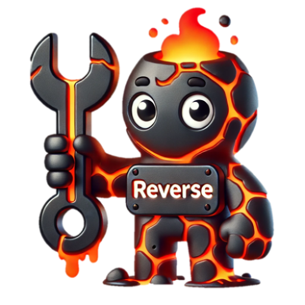

<div align="center">
  

  <h1>REVERSE-VLM:
    Vision-Language Model with <br>
    <span style="font-weight: normal;">
      <span style="color:#d35400; text-decoration: underline; font-weight: bold;">RE</span>trospective 
      <span style="color:#d35400; text-decoration: underline; font-weight: bold;">VER</span>ification and 
      <span style="color:#d35400; text-decoration: underline; font-weight: bold;">SE</span>lf-correction
    </span>
  </h1>

  <p>
    <a href="https://huggingface.co/collections/tsunghanwu/reverse-67f410b5d147edf2ed7817ae">
      
    </a>
    &nbsp;
    <a href="https://arxiv.org/abs/2504.13169">
      
    </a>
  </p>

</div>

---

Welcome to the official repository for our paper: [**Generate, but Verify: Reducing Hallucination in Vision-Language Models with Retrospective Resampling**](https://arxiv.org/abs/2504.13169). Explore our project page [here](https://reverse-vlm.github.io/) for an interactive overview!

**Authors**: [Tsung-Han Wu](https://tsunghan-wu.github.io/), [Heekyung Lee](https://linkedin.com/in/heekyung-lee-624753289), [Jiaxin Ge](https://jiaxin.ge), [Joseph E. Gonzalez](https://people.eecs.berkeley.edu/~jegonzal/), [Trevor Darrell](https://people.eecs.berkeley.edu/~trevor/), [David M. Chan](https://dchan.cc/) (UC Berkeley & POSTECH)

### 🔗 Model Checkpoints:
- 🤗 [tsunghanwu/reverse_llava_v15](https://huggingface.co/tsunghanwu/reverse_llava_v15)  
- 🤗 [tsunghanwu/reverse_llava_more](https://huggingface.co/tsunghanwu/reverse_llava_more)

### 📦 Dataset:
- 🧾 [REVERSE Visual Instruct 1.3M](https://huggingface.co/datasets/tsunghanwu/reverse-instruct-1.3m)

### 📄 Change Log:
- [04/17/2025]: REVERSE is now live on HuggingFace and GitHub! Explore checkpoints, dataset, and full paper from our <a href="https://reverse-vlm.github.io/">project site</a>.

---

## :wrench: Installation Guide

1. Clone this repository
```bash
git clone https://github.com/tsunghan-wu/reverse_vlm
cd reverse_vlm
```

2. Set up the environment

```bash
conda create -n reverse python=3.10 -y
conda activate reverse
pip install --upgrade pip  # enable PEP 660 support
pip install -e .
```

3. Install additional packages for training cases
```
pip install -e ".[train]"
pip install flash-attn --no-build-isolation --no-cache-dir
```

## 📈 Evaluation

- Download model checkpoints:  
  - 🤗 [reverse_llava_v15](https://huggingface.co/tsunghanwu/reverse_llava_v15)  
  - 🤗 [reverse_llava_more](https://huggingface.co/tsunghanwu/reverse_llava_more)

- Download required evaluation files from [Google Drive](https://drive.google.com/file/d/1gdGFNFUAe09dAObVK3Riyr-4ejxYqMSt/view?usp=sharing)  
  → Unzip and place them into `playground/data/eval`. Then, follow the included instructions to download additional assets.

- Run evaluations with:

```bash
bash scripts/eval/*.sh
```

We conduct 100-round bootstrapped evaluation. Reported numbers should closely match those in the paper.

## 🚀 Training

### 1. Data Preparation

- Download QA pairs from: 🤗 [tsunghanwu/reverse-instruct-1.3m](https://huggingface.co/datasets/tsunghanwu/reverse-instruct-1.3m)  

- Organize datasets under `playground/data/` using the following structure (following [LLaVA’s layout](https://github.com/haotian-liu/LLaVA?tab=readme-ov-file#visual-instruction-tuning)):

<details>
    <summary>Show Data Structure</summary>
    <pre>
playground/data/
├── coco
│   ├── annotations
│   ├── test2017
│   ├── train2017
│   └── val2017
├── gqa
│   └── images
├── ocr_vqa
│   └── images
├── share_textvqa
│   └── images
├── textvqa
│   └── train_images
└── vg
    ├── VG_100K
    └── VG_100K_2
    </pre>
</details>

### 2. Model Setup and Training

- Add special tokens to the base LLM:

```bash
python3 scripts/add_new_token_to_llm.py
```

Supported settings:
- [lmsys/vicuna-7b-v1.5](https://huggingface.co/lmsys/vicuna-7b-v1.5), with mm_projector weights from [LLaVA-v1.5-7B's projector](https://huggingface.co/liuhaotian/llava-v1.5-mlp2x-336px-pretrain-vicuna-7b-v1.5)
- [meta-llama/Llama-3.1-8B-Instruct](https://huggingface.co/meta-llama/Llama-3.1-8B-Instruct), with mm_projector weights from [LLaVA-MORE-8B's projector](https://huggingface.co/aimagelab/LLaVA_MORE-llama_3_1-8B-pretrain)

- Launch Training: `ash scripts/train/*.sh`

### 3. Merge LoRA Weights
After training, merge the LoRA adapter weights into the base model:

```
CUDA_VISIBLE_DEVICES=5 python3 scripts/merge_lora_weights.py --model-path <your lora path> --model-base <the base llm path with new tokens> --save-model-path <final model path>
```

> ⚠️ Notes:  
> - Set `GPU_SETTINGS` and `MASTER_PORT` appropriately when using DeepSpeed.  
> - **Naming matters**:  
>   - Your LoRA directory should contain `llava_lora`  
>   - The final merged model path should contain `llava`  
>   This is required due to how LLaVA loads models internally — otherwise, it may fail silently or load incorrectly.


## 🙏  Acknowledgements

We are grateful for the foundational code provided by [LLaVA](https://github.com/haotian-liu/LLaVA) and [LLaVA-More](https://github.com/aimagelab/LLaVA-MORE). Utilizing their resources implies agreement with their respective licenses. Our project benefits greatly from these contributions, and we acknowledge their significant impact on our work. 

## 📚 Citation

If you use our work or our implementation in this repo or find them helpful, please consider giving a citation.
```
@article{wu2025reverse,
  title={Generate, but Verify: Reducing Hallucination in Vision-Language Models with Retrospective Resampling},
  author={Wu, Tsung-Han and Lee, Heekyung and Ge, Jiaxin and Gonzalez, Joseph E and Darrell, Trevor and Chan, David M},
  journal={arXiv preprint arXiv:2504.13169},
  year={2025}
}
```
